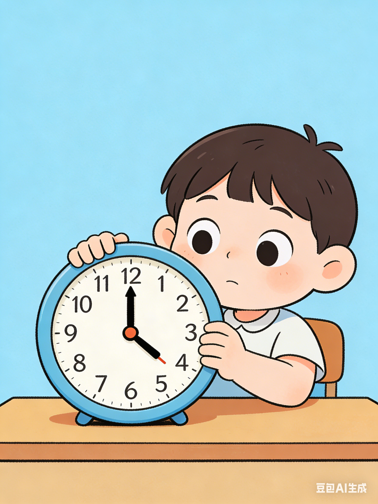

# 时钟教学

  

**一个帮助孩子轻松学会看时钟的互动教学应用**

[在线体验](https://zhangqixiang-sh.github.io/clock-teching/) 

## ✨ 特色

- 🎮 **互动式学习** - 孩子可以亲手拨动时钟指针，在实践中理解时间的概念
- 📚 **循序渐进** - 从认识钟面开始，一步步引导孩子掌握时针、分针、秒针
- 🎯 **趣味测验** - 多种测验模式和难度级别，让学习充满挑战与成就感
- � **双语支持** - 中英文界面随意切换，学习时间的同时还能练习语言
- 🔊 **音效反馈** - 正确、错误都有声音提示，给孩子即时的学习反馈
- 📱 **随时随地** - 手机、平板、电脑都能用，出门在外也能学习

---

## 🎯 三大学习模块

### 📖 认识时钟

从零开始，分 5 个步骤带孩子认识钟面、时针、分针、秒针，以及它们之间的关系。配合生动的动画和高亮提示，让抽象的时间概念变得直观易懂。

### 🖐️ 自由练习

一个可以自由拨动的互动时钟！孩子可以随意调整时间，实时看到对应的数字时间显示。支持 5 分钟刻度吸附，帮助理解"几点几分"的概念。

### 🏆 测验挑战

两种测验模式，四种难度级别：
- **看钟说时间** - 看时钟显示，选择正确的时间
- **拨钟设时间** - 看时间，把时钟拨到正确的位置

从整点到精确到分钟，难度逐步提升，让孩子在挑战中成长！

---

## 💡 适合谁使用？

- 🧒 **学龄前儿童** - 开始接触时间概念的孩子
- 👨‍👩‍👧 **家长** - 想要辅导孩子学习时间的父母
- 👩‍🏫 **教师** - 需要教学工具的幼儿园和小学老师
- 🌐 **语言学习者** - 想要学习中文或英文时间表达的学习者
